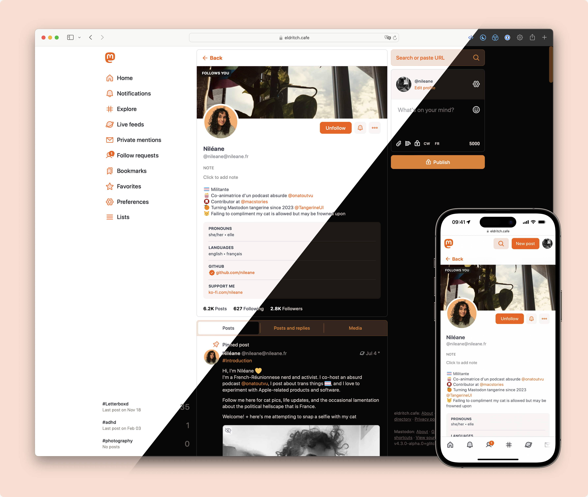
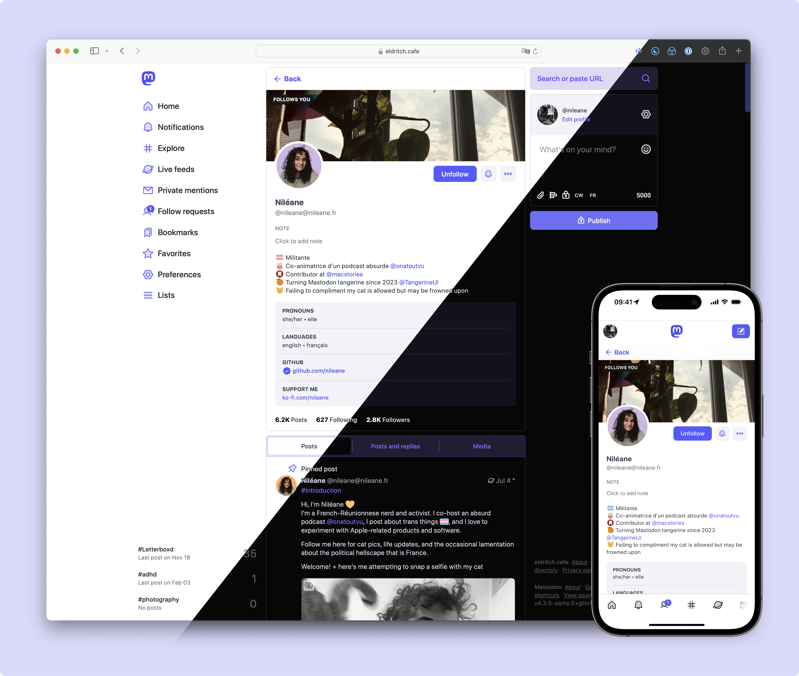
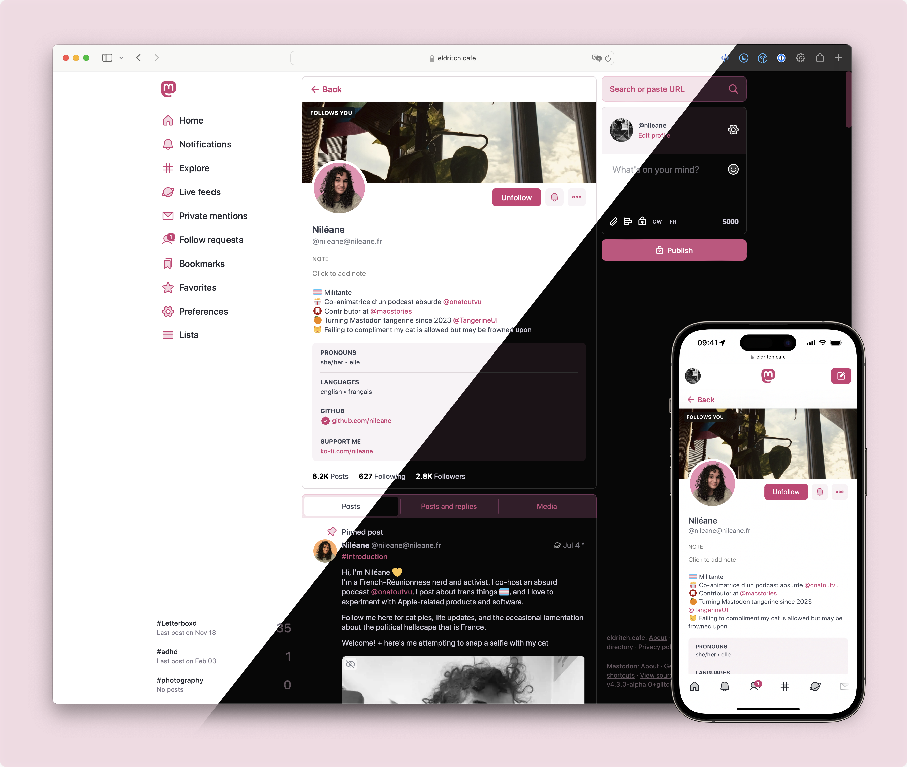

<h1>
 <picture>
  <source media="(prefers-color-scheme: dark)" srcset="./art/Logo_Wide_Dark.png?raw=true">
  <source media="(prefers-color-scheme: light)" srcset="./art/Logo_Wide.png?raw=true">
  
 </picture>
</h1>

Tangerine UI is a vibrant, fully-featured custom theme for Mastodon's Web UI that comes in four variants: 🍊 Tangerine, 🪻 Purple, 🍒 Cherry, and 🐠 Lagoon.

[🕹️ **Live demo** @ nileane.fr](https://nileane.fr) • [👋 **Follow Tangerine UI** on Mastodon](https://nileane.fr/@TangerineUI) • [📝 **Release notes**](https://github.com/nileane/TangerineUI-for-Mastodon/releases)

## Table of contents

1. [**Overview**](#overview)
    * [**Variants**](#variants)
    * [**Features**](#features)
    * [**List of instances that use Tangerine UI**](#list-of-instances-that-use-tangerine-ui)
2. [**Compatibility**](#compatibility)
6. [**Installation** for Mastodon instance admins](#installation-for-mastodon-admins)
7. [**Installation** for regular users](#installation-for-regular-users)
8. [**Accessibility**](#accessibility)
9. [**Credits**](#credits)
10. [**Support me**](#support-me-3)
  
## Overview

### Variants

**🍊 Tangerine**  
Default variant for Tangerine UI, featuring a soft orange palette.

  
&nbsp;


**🪻 Purple**  
For those of you who like Tangerine UI but want to stick to Mastodon's purple hue.

  
&nbsp;


**🍒 Cherry**  
I won't be held responsible if you end up licking your screen because of this one.
  
  
&nbsp;


**🐠 Lagoon**  
Soft turquoise palette that gives neon vibes at night.

  
&nbsp;


### Features

🧑‍🔬 **Support for the advanced web interface**  
All variants of Tangerine UI support Mastodon's multi-column layout.
  
  


🚀 **Playful animations**  
The rocket flies!
  
  


<br>🌚 **Dark mode**  
Tangerine UI automatically switches from light to dark mode based on your system or browser preference.[^1]
[^1]: Tangerine UI uses the [`prefers-color-scheme`](https://developer.mozilla.org/en-US/docs/Web/CSS/@media/prefers-color-scheme) CSS media feature to detect if you have requested a light or dark theme through an operating system setting or a user agent setting.
  
💬 **Distinct look for DMs**  
It can be easy to mistake a DM for a regular post on Mastodon. Tangerine UI gives DMs a specific look, so they stand out in your timeline, and you don't make any embarrassing mistakes.

👁️ **Compact timeline**  
Avatars are aligned on the side, margins are properly reduced, and threads are easier to read.
  
✴️ **Phosphor icons**  
Tangerine UI uses a selection of icons from the beautiful [Phosphor](https://phosphoricons.com) icon family

🔍 **Zoom on emojis**  
  Custom emojis are great, but they may be difficult to distinguish when they are overly detailed. Tangerine UI allows you to hover and pause over an emoji to enlarge it.

✳️ **and more**  
Tangerine UI was designed with care and great attention to detail. Feel free to explore all the changes it brings to Mastodon's UI, and feel free to [message me](https://nileane.fr/@TangerineUI) if you ever have any feedback to share or [bugs to report](https://github.com/nileane/TangerineUI-for-Mastodon/issues). :)


### List of instances that use Tangerine UI
This is a list of known Mastodon instances on which Tangerine UI has been installed, either as the only theme or as an optional theme.[^2]
[^2]: If you're an admin and have installed Tangerine UI on your instance, **feel free to add yours to this list**. (Make a Pull Request, or just [DM me](https://nileane.fr/@tangerineui))

| **Instance**                                               | **User count** | **Installed as...** | **Default theme?**      |
| ---------------------------------------------------------- | -------------- | ------------------- | ----------------------- |
| [hachyderm.io](https://hachyderm.io)                       | 11K+           | an optional theme   | No                      |
| [piaille.fr](https://piaille.fr)                           | 10K+           | an optional theme   | No                      |
| [social.vivaldi.net](https://social.vivaldi.net)           | 7K+            | an optional theme   | No                      |
| [norden.social](https://norden.social)                     | 5K+            | an optional theme   | No                      |
| [convo.casa](https://convo.casa)                           | 5K+            | an optional theme   | No                      |
| [wxw.moe](https://wxw.moe)                                 | 3.5K+          | an optional theme   | No                      |
| [c.im](https://c.im)                                       | 3.2k+          | an optional theme   | No                      |
| [masto.es](https://masto.es)                               | 2K+            | an optional theme   | No                      |
| [vmst.io](https://vmst.io)                                 | 2K+            | an optional theme   | No                      |
| [framapiaf.org](https://framapiaf.org)                     | 1.5K+          | an optional theme   | No                      |
| [eldritch.cafe](https://eldritch.cafe)                     | 1.5K+          | an optional theme   | No                      |
| [octodon.social](https://octodon.social)                   | 1K+            | an optional theme   | No                      |
| [social.lol](https://social.lol)                           | 1K+            | an optional theme   | No                      |
| [mountains.social](https://mountains.social)               | 550+           | an optional theme   | No                      |
| [shelter.moe](https://shelter.moe)                         | 350+           | an optional theme   | No                      |
| [toki.social](https://toki.social)                         | 200+           | an optional theme   | No                      |
| [dmv.community](https://dmv.community)                     | 200+           | an optional theme   | No                      |
| [c7.io](https://c7.io)                                     | 200+           | an optional theme   | Yes (Tangerine variant) |
| [pipou.academy](https://pipou.academy)                     | 100+           | an optional theme   | No                      |
| [indiepocalypse.social](https://indiepocalypse.social)     | 100+           | an optional theme   | No                      |
| [town.voyager.blue](https://town.voyager.blue)             | 100+           | an optional theme   | Yes (Custom variant)    |
| [tooter.social](https://tooter.social)                     | 90+            | an optional theme   | No                      |
| [pointless.chat](https://pointless.chat)                   | 50+            | an optional theme   | No                      |
| [acg.mn](https://acg.mn)                                   | 50+            | an optional theme   | No                      |
| [yttrx.com](https://yttrx.com)                             | 40+            | an optional theme   | No                      |
| [bolha.one](https://bolha.one)                             | 20+            | an optional theme   | Yes (Tangerine variant) |
| [i1.no](https://i1.no)                                     | 15+            | the only theme      | Yes (Purple variant)    |
| [zeppelin.flights](https://zeppelin.flights)               | 15+            | the only theme      | Yes (Tangerine variant) |
| [catharsis.cafe](https://catharsis.cafe)                   | 10+            | an optional theme   | Yes (Tangerine variant) |
| [toulouse.social](https://toulouse.social)                 | 10+            | an optional theme   | Yes (Tangerine variant) |
| [fedinerds.social](https://fedinerds.social)               | 10+            | an optional theme   | No                      |
| [ngmx.com](https://ngmx.com)                               | 10+            | an optional theme   | No                      |
| [nileane.fr](https://nileane.fr)                           | 5+             | the only theme      | Yes (Tangerine variant) |
| [social.nah.re](https://social.nah.re)                     | 5+             | an optional theme   | No                      |
| [esoteric.party](https://esoteric.party)                   | 5+             | the only theme      | Yes (Tangerine variant) |
| [asso.lgbt](https://asso.lgbt)                             | 5+             | the only theme      | Yes (Purple variant)    |
| [Buddyverse.xyz](https://buddyverse.xyz)                   | 5+             | an optional theme   | No                      |
| [isfeeling.social](https://isfeeling.social)               | 1+             | the only theme      | Yes (Purple variant)    |
| [ucn.social](https://ucn.social)                           | 1+             | an optional theme   | Yes (Tangerine variant) |
| [fedi.cyberwitches.club](https://fedi.cyberwitches.club)   | 1+             | the only theme      | Yes (Purple variant)    |
| [mastodon.projetretro.io](https://mastodon.projetretro.io) | 1+             | an optional theme   | No                      |
| [everythingbagel.social](https://everythingbagel.social)   | 1+             | an optional theme   | No                      |
| [social.spicyweb.dev](https://social.spicyweb.dev)         | 1+             | the only theme      | Yes                     |
| [e5n.cc](https://e5n.cc)                                   | 1+             | the only theme      | Yes (Lagoon)            |
| [erica.moe](https://erica.moe)                             | 5+             | an optional theme   | Yes (Purple variant)    |

## Compatibility
✅ [**Tangerine UI** (v2._x_)](https://github.com/nileane/TangerineUI-for-Mastodon/releases/latest) **is compatible with instances running Mastodon 4.3 and newer.**[^3]
[^3]: Tangerine UI (v2._x_) is also compatible with instances running a version of **Glitch-soc** based on Mastodon 4.3 and newer, as long as it is [installed as a vanilla theme](#installation-for-glitch-soc-admins) on these instances.

⚠️ For instances running Mastodon 4.1._x_ or 4.2._x_, use [**Tangerine UI Legacy** (v1.9)](https://github.com/nileane/TangerineUI-for-Mastodon/tree/legacy) instead.[^4][^5]
[^4]: The advanced web interface (multi-column layout) is not supported by Tangerine UI Legacy (v1.9) and will fall back to Mastodon's default appearance if enabled.
[^5]: The Cherry variant is not available with Tangerine UI Legacy (v1.9).
    
🚫 Tangerine UI and Tangerine UI Legacy are not compatible with instances running Mastodon 4.0._x_ and older.


## Installation for Mastodon admins

There are two ways to install Tangerine UI on your Mastodon instance:
* as the **only** theme
* as an **optional** theme \[Recommended\]

### Install Tangerine UI as the only theme on your instance:
1. **Check your Mastodon version**. For Tangerine UI to work properly, you need to make sure you're installing the right version for your Mastodon instance. Please refer to the [Compatibility](#compatibility) section in this document before you proceed.

2. Copy & paste the contents of 🍊 [`TangerineUI.css`](https://github.com/nileane/TangerineUI-for-Mastodon/blob/main/TangerineUI.css) to the '***Custom CSS***' field in the administration panel on your Mastodon instance (Navigate to https://*domain*/admin/settings/appearance).
   * 🪻 For the Purple variant, copy the contents of [`TangerineUI-purple.css`](https://github.com/nileane/TangerineUI-for-Mastodon/blob/main/TangerineUI-purple.css) instead.
   * 🍒 For the Cherry variant, copy the contents of [`TangerineUI-cherry.css`](https://github.com/nileane/TangerineUI-for-Mastodon/blob/main/TangerineUI-cherry.css) instead.
   * 🐠 For the Lagoon variant, copy the contents of [`TangerineUI-lagoon.css`](https://github.com/nileane/TangerineUI-for-Mastodon/blob/main/TangerineUI-lagoon.css) instead.

> [!WARNING]
> **Using the '*Custom CSS*' field to apply Tangerine UI will prevent all users on your instance from being able to choose another theme in their Appearance settings** ([see *Accessibility*](#accessibility)).  
> Please make sure there is a consensus among your users for doing so. If not, see below how to install Tangerine UI as an optional theme for your users.

### Install Tangerine UI as an optional theme on your instance [Recommended]:
Follow these instructions to install Tangerine UI as an optional theme on your Mastodon instance.  
Your users will be able to select Tangerine UI in their settings on the web, and you will be able to set Tangerine UI as the default theme for your instance.

<details>
<summary><strong>Install (using the included script)</strong></summary>
<br>

A basic installation script is included in this repository.  
It can be used to install Tangerine UI on your Mastodon instance for the first time, and to automate the process of updating Tangerine UI.

Run the following commands as the `mastodon` user to install Tangerine UI using the [included script](https://github.com/nileane/TangerineUI-for-Mastodon/blob/main/install.sh.sample):

1. **Clone** the Tangerine UI repository
```sh
git clone https://github.com/nileane/TangerineUI-for-Mastodon.git ./TangerineUI
cd TangerineUI
```

2. **Copy** the sample install script.
```sh
cp install.sh.sample install.sh
```

Make sure the Mastodon and Tangerine UI directory paths at the top of `install.sh` are correct:
  * Edit the line beginning with `TANGERINEUI=` to adjust the path to the Tangerine UI directory.
  * Edit the line beginning with `MASTODON=` to adjust the path to your Mastodon installation directory.

3. **Run** the install script.
```sh
./install.sh
```

Optionally, run with `--skip-confirm` to bypass all confirmation prompts:
```sh
./install.sh --skip-confirm
```

4. **\[Optional\] Add a localized name.** You can edit each desired language's locale file in `config/locales/[lang].yml` to add a localized string name for Tangerine UI. You need to do this for every language you expect your users to use. Otherwise, in their themes list, they will see the unlocalized theme name ("*tangerineui-purple*"), instead of a readable theme name ("*Tangerine UI (Purple)*").

```yml
themes:
  contrast: Mastodon (High contrast)
  default: Mastodon (Dark)
  mastodon-light: Mastodon (Light)
  tangerineui: Tangerine UI
  tangerineui-purple: Tangerine UI (Purple)
  tangerineui-cherry: Tangerine UI (Cherry)
  tangerineui-lagoon: Tangerine UI (Lagoon)
```

5. **Restart** your Mastodon instance for the changes to take effect.

Your users should now be able to choose '*Tangerine UI*', '*Tangerine UI (Purple)*', '*Tangerine UI (Cherry)*', or '*Tangerine UI (Lagoon)*' as their site theme:


As an admin, you should also now be able to set Tangerine UI as the default theme for your instance (navigate to https://*domain*/admin/settings/appearance):


</details>


<details>
<summary><strong>Install manually</strong></summary>

1. **Check your Mastodon version**. For Tangerine UI to work properly, you need to make sure you're installing the correct version for your Mastodon instance. Please refer to the [Compatibility](#compatibility) section in this document before you proceed.

2. **Copy** the files from `mastodon/app/javascript/styles/` [in this repository](https://github.com/nileane/TangerineUI-for-Mastodon/tree/main/mastodon/app/javascript/styles/) to your Mastodon themes directory `app/javascript/styles/`:

```sh
# Where $REPO is this repository, and $INSTALLDIR is your Mastodon installation.
cp -r $REPO/mastodon/app/javascript/styles/* $INSTALLDIR/app/javascript/styles
```


3. **Add Tangerine UI to `themes.yml`**. To make Tangerine UI available in your users' settings, you need to add a new line to [`config/themes.yml`](https://github.com/mastodon/mastodon/blob/main/config/themes.yml). Here, we're adding 4 new lines, one for each variant:

```yml
default: styles/application.scss
contrast: styles/contrast.scss
mastodon-light: styles/mastodon-light.scss
tangerineui: styles/tangerineui.scss
tangerineui-purple: styles/tangerineui-purple.scss
tangerineui-cherry: styles/tangerineui-cherry.scss
tangerineui-lagoon: styles/tangerineui-lagoon.scss
```

4. **\[Optional\] Add a localized name.** You can edit each desired language's locale file in `config/locales/[lang].yml` to add a localized string name for Tangerine UI. You need to do this for every language you expect your users to use. Otherwise, in their themes list, they will see the unlocalized theme name ("*tangerineui-purple*"), instead of a readable theme name ("*Tangerine UI (Purple)*").

```yml
themes:
  contrast: Mastodon (High contrast)
  default: Mastodon (Dark)
  mastodon-light: Mastodon (Light)
  tangerineui: Tangerine UI
  tangerineui-purple: Tangerine UI (Purple)
  tangerineui-cherry: Tangerine UI (Cherry)
  tangerineui-lagoon: Tangerine UI (Lagoon)
```

5. **Compile** assets:
```sh
RAILS_ENV=production bundle exec rails assets:precompile
```

6. **Restart** your Mastodon instance for the changes to take effect.

Your users should now be able to choose '*Tangerine UI*', '*Tangerine UI (Purple)*', '*Tangerine UI (Cherry)*', or '*Tangerine UI (Lagoon)*' as their site theme:


As an admin, you should also now be able to set Tangerine UI as the default theme for your instance (navigate to https://*domain*/admin/settings/appearance):


   
</details>


<details>
<summary>Specific instructions for <strong>Glitch-soc instances</strong></summary>

Tangerine UI does not yet support Glitch-soc's features and layout, but it can still be installed as a vanilla skin on your Glitch-soc instance:

1. **Copy the files** from `mastodon/app/javascript/styles/` [in this repository](https://github.com/nileane/TangerineUI-for-Mastodon/tree/main/mastodon/app/javascript/styles/) to your Mastodon themes directory `app/javascript/styles/`:

```sh
# Where $REPO is this repository, and $INSTALLDIR is your Glitch-soc installation.
cp -r $REPO/mastodon/app/javascript/styles/* $INSTALLDIR/app/javascript/styles
```

2. **Copy the files** from `mastodon/app/javascript/skins/vanilla/` [in this repository](https://github.com/nileane/TangerineUI-for-Mastodon/tree/main/mastodon/app/javascript/skins/vanilla/) to your Glitch-soc skins directory `app/javascript/skins/vanilla/`:

```sh
# Where $REPO is this repository, and $INSTALLDIR is your Glitch-soc installation.
cp -r $REPO/mastodon/app/javascript/skins/vanilla/* $INSTALLDIR/app/javascript/skins/vanilla
```

3. **Compile** assets:
```sh
RAILS_ENV=production bundle exec rails assets:precompile
```

5. **Restart** your instance for the changes to take effect.

Your users should now be able to select Tangerine UI as a theme in their settings, under Flavours → Vanilla Mastodon → Skin


</details>


## Installation for regular users
Even if you are not an admin on your instance, you can still use Tangerine UI with a browser extension:

1. **Check your Mastodon version**. For Tangerine UI to work properly, you need to make sure you're using the correct version for your Mastodon instance. Please refer to the [Compatibility](#compatibility) section in this document before you proceed.
2. **Install a browser extension** that allows you to inject CSS on a webpage, such as [Stylus](https://add0n.com/stylus.html), or [Live CSS Editor](https://github.com/webextensions/live-css-editor)
3. Copy & paste the contents of 🍊 [`TangerineUI.css`](https://github.com/nileane/TangerineUI-for-Mastodon/blob/main/TangerineUI.css) to the extension's editor
   * 🪻 For the Purple variant, copy the contents of [`TangerineUI-purple.css`](https://github.com/nileane/TangerineUI-for-Mastodon/blob/main/TangerineUI-purple.css) instead.
   * 🍒 For the Cherry variant, copy the contents of [`TangerineUI-cherry.css`](https://github.com/nileane/TangerineUI-for-Mastodon/blob/main/TangerineUI-cherry.css) instead.
   * 🐠 For the Lagoon variant, copy the contents of [`TangerineUI-lagoon.css`](https://github.com/nileane/TangerineUI-for-Mastodon/blob/main/TangerineUI-lagoon.css) instead.

> [!IMPORTANT]
> If you are a user on a Glitch-soc instance, you must switch to the Vanilla Mastodon flavour for Tangerine UI to work properly: in your instance settings, navigate to *Flavours* → *Vanilla Mastodon* → select the '*Default*' skin.

> [!NOTE]
> Alternatively, if you wish to use a JavaScript browser extension, [@Write](https://github.com/Write) has written a ready-to-use UserScript to load Tangerine UI on any Mastodon instance. Check out [the TangerineUI-Userscript repository](https://github.com/Write/TangerineUI-Userscript) for instructions.


## Accessibility
Please consider that some of your users may depend on Mastodon's High Contrast theme before [setting Tangerine UI as the only theme](#install-tangerine-ui-as-the-only-theme-on-your-instance) on your instance. For this reason, unless you're running a single-user instance, I strongly recommend [installing Tangerine UI as an optional/revertable theme](#install-tangerine-ui-as-an-optional-theme-on-your-instance-recommended) instead.

## Credits
The logo for Tangerine UI was originally designed by [Younis @younishd](https://younishd.fr). 🍊

## Support me <3
If you enjoy Tangerine UI, I would really appreciate a [tip 💛](https://ko-fi.com/nileane)!
